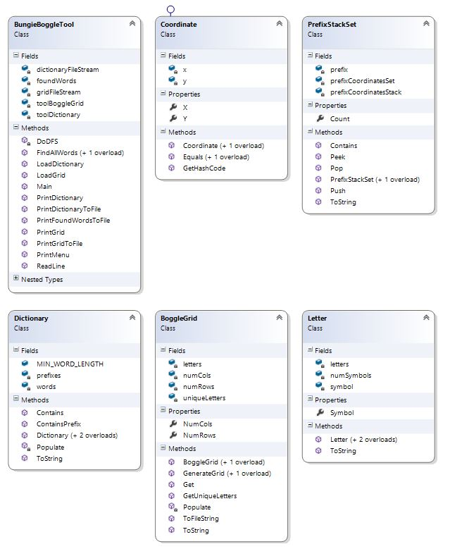
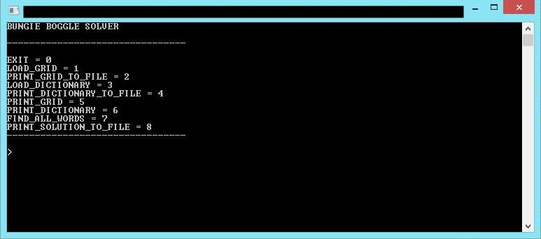

BungieBoggleTool
================
GOAL
----------------
Write a program which will find all the words on a generalized Boggle™ board.  It should take as input the board dimensions and the board, and should load a dictionary of valid words (shared for all users). It should output the list of all found words. You should consider how your approach will perform with a large dictionary and a large board.

If you've never heard of Boggle then see http://en.wikipedia.org/wiki/Boggle for a better description than I can write.  A 3x3 boggle board that looks like this:

    y o x
    r b a
    v e d

Has exactly the following words on it (according to my program):

	bred, yore, byre, abed, oread, bore, orby, robed, broad, byroad, robe
	bored, derby, bade, aero, read, orbed, verb, aery, bead, bread, very, road

Note that it doesn't have “robbed” or “robber” because that would require reusing some letters to form the word.  And it doesn’t have “board” or “dove” because that would require using letters which aren’t neighbors.

Use the program you’ve created! 

Write a suite of automated tests to be run against the program you created, then generate a report of passed and failed cases. Be sure to include enough information in the reports that you could follow up effectively on the issues.  Why did you choose to automate what you did?  How do you provide information from failures that’s easily debuggable?

SOLUTION
----------------
Written in Visual Studio 2013

###Files

- **<a href="resources/sowpods.txt">sowpods.txt</a>**: [Europe Scrabble Word List](http://www.freescrabbledictionary.com/sowpods.txt).
- **<a href="resources/twl_2006_length.txt">twl_2006_length.txt</a>**: [Scrabble Junction Word List](http://www.scrabblejunction.org/wordlists.htm).
- **<a href="resources/ospd.txt">ospd.txt</a>**: [Official Scrabble Players Dictionary](http://www.puzzlers.org/pub/wordlists/ospd.txt).
- **<a href="bungieboggletool.cd">bungieboggletool.cd</a>**: Class diagram of the console application.
- **<a href="bungieboggletool.cs">bungieboggletool.cs</a>**: Main file containing console application.
- **<a href="dictionary.cs">dictionary.cs</a>**: Class representing the dictionary list of words to check against.
- **<a href="bogglegrid.cs">bogglegrid.cs</a>**: Class representing the Boggle Grid.
- **<a href="letter.cs">letter.cs</a>**: Class representing the Boggle Block.
- **<a href="coordinate.cs">coordinate.cs</a>**: Class representing a coordinate.
- **<a href="prefixstackset.cs">prefixstackset.cs</a>**: Class that contains Stack and Set functionality and tracks current prefix.  Used in the iterative DFS algorithm.

###Installation

- Download the repository locally
- Open the .sln file in Visual Studio 2013

###Approach
Essentially the problem has two parts:

1.  **Finding the possible string combinations among the grid.**  
    For this portion I decided that the best approach would be a *depth-first search*.  Since it is a graph and we cannot double over traversed nodes, *DFS* would be the fastest approach.  *DFS* also allows for failing fast.  If we start a search, every iteration can be treated as a prefix that can be verified against the **Dictionary** (The **Dictionary** will contain the possible prefixes according the the of words as well). At worst case (where all string combinations are legal), the DFS will search the entire graph O(n3), where n is the number of elements in the graph. 

2.  **Checking string combinations against a list.**  
    For this portion I decided to create a **Dictionary** class that will contain a **Set** of *words* and a **Set** of *possible pre-fixes*.  I chose **Set**'s because I do not care about duplicates.  The class also constructs against both the file of words as well as the grid instance, as we only care about *possible words* (we rule out any words that contain letters not found in the grid).  Constructing the **Dictionary** is O(n), where n is the number of characters in the dictionary file.  Prefix and word lookup are O(1) expected due to the **HashSet** implementation in C#.  At this point, the words are limited to words at least larger than 3.  The size restriction can be set by the static variable in **Dictionary**.

###Pros
- **Extensible**: Dictionaries can be swapped out by simply changing the file.  Object-oriented design means that different algorithms can be implemented by subclassing the appropriate classes.
- **Agile**: After populating a full dictionary without a grid, subsequent grids can be checked against the Dictionary at will.  Pre-fix and word lookup are *O(1)* expected with HashSets.
- **Scalable**: **HashSet**'s and **Dictionary< Tkey, TValue >**'s are implemented with large scalability in mind while maintaining expected *O(1)* time lookup.  Also, unlike **Array**'s, they are usually stored in non-continguous memory, meaning they are not as expensive to resize larger.
- **Automatable**: With the framework provided, the solution is easy to automate.  **BoggleGrid**'s can generate boards at will and swapping dictionaries is a simple matter.
- **Localizable**: The **Letter** class can hold multiple characters to represent the block value.  Another feature is that by Subclassing Dictionary and Letter, you can overrwrite how the words and letters are stored or represented for
international characters.
- **Format-Independent**: If the files are incorrectly formatted (i.e, illegal characters in the row and column fields of the **BoggleGrid** input), the code will revert to default constructors and print to console.

###Cons
- **Expensive**: Requires time to process the dictionary and its pre-fixes before checking against string combinations.
- **Slow Construction**: Construction of the objects (**Dictionary** specifically) takes time as they require File IO.

TESTING
----------------
Tests were built with Visual Studio 2013 Unit Testing.

###Files
- **<a href="d:\users\michael\source\repos\bungieboggletool\bungieboggletool\bungieboggletoolunittests\bungieboggletooltests.cs">bungieboggletooltests.cs</a>**: Unit Test file for the BungieBoggleTool.
- **<a href="d:\users\michael\source\repos\bungieboggletool\bungieboggletool\bungieboggletoolunittests\dictionarytests.cs">dictionarytests.cs</a>**: Unit Test file for the Dictionary.
- **<a href="d:\users\michael\source\repos\bungieboggletool\bungieboggletool\bungieboggletoolunittests\bogglegridtests.cs">bogglegridtests.cs</a>**: Unit Test file for the BoggleGrid.
- **<a href="d:\users\michael\source\repos\bungieboggletool\bungieboggletool\bungieboggletoolunittests\lettertests.cs">lettertests.cs</a>**: Unit Test file for the Letter.
- **<a href="d:\users\michael\source\repos\bungieboggletool\bungieboggletool\bungieboggletoolunittests\coordinatetests.cs">coordinatetests.cs</a>**: Unit Test file for the Coordinate.
- **<a href="d:\users\michael\source\repos\bungieboggletool\bungieboggletool\bungieboggletoolunittests\prefixstacksettests.cs">prefixstacksettests.cs</a>**: Unit Test file for the PrefixStackSet.
- **<a href="d:\users\michael\source\repos\bungieboggletool\bungieboggletool\bungieboggletoolunittests\resources.cs">resources.cs</a>**: File contain file paths.  Update the resource full path to your machine to get the grid tests to run.  Can also generate a grid file of provided dimensions.  Set GENERATE_GRID to 'true' and set the desired dimensions.

###Summary
Each class has a set of unit tests covering basic functionality as well as scenarios.  BungieBoggleToolTests contains a set of tests that verify multiple grids against solution files.  The solution files the format of gridFileName + "Solution" + Resource.FILE_EXTENSION.

The 6x6 grids and solutions were generated by [Big Boggle Solver: 6x6 Frid Helper](http://www.hanginghyena.com/solvers/6x6-boggle-solver).
The 10x10 grid and solution was generated by [The Word Solver](http://www.wordsolver.co.uk/).

(Note: The sites were only used as reference for test cases only)

The Console Application built when compileing and running BungieBoggleTool has a basic Console UI that can be used to run manual tests.

###File Formatting

In order to comply with the Unit Tests, input files should be stored in the \Resources dir.  Add the filenames to the Resources.cs file and ensure they are the appropriate extension according to the Resources.cs file.

- **Grid File**  
n  
m  
a00a01a0..a0(m-1)  
a10a11a1..a1(m-1)  
a..0a..1a.. ..a..(m-1)  
a(n-1)0a(n-1)1a(n-1)..a(n-1)(m-1)a  

where **n** is the number of rows, **m** is the number of columns, and **a** is a character of the designated boggle block (in this case a-z, A-Z, #, where # designates 'Qu').

- **Dictionary File**  
word0  
word1  
...  
wordn-1  

where **n** is the number of words.  Words should be delimited by new lines.  Input terminate by EOF.

- **Solution File**  
word0  
word1  
...  
wordn-1  

where **n** is the number of words.  Words should be delimited by new lines.  Input terminate by EOF.

###Test Cases
(Note: '#' denotes a 'Qu' block.  Solutions are based on ospd.txt)

- **<a href="resources/bogglegrid1.txt">bogglegrid1.txt</a>**: Initial 3x3 grid provided by Bungie.

    yox  
    rba  
    ved  

    <a href="resources/bogglegrid1solution.txt">bogglegrid1solution.txt</a>

- **<a href="resources/bogglegrid2.txt">bogglegrid2.txt</a>**: Simple 2x2 grid.

    CO  
    AT  

    <a href="resources/bogglegrid2solution.txt">bogglegrid2solution.txt</a>

- **<a href="resources/gbogglegrid0.txt">gbogglegrid0.txt</a>**: 6x6 grid randomly generated by BoggleGrid.Generate(6, 6) and solved by [Big Boggle Solver: 6x6 Frid Helper](http://www.hanginghyena.com/solvers/6x6-boggle-solver).

    plrntp  
    lnprce  
    rpxeck  
    nreimq  
    tccmmw  
    pekqwb  

    <a href="resources/gbogglegrid0solution.txt">gbogglegrid0solution.txt</a>

- **<a href="resources/gbogglegrid1.txt">gbogglegrid1.txt</a>**: 6x6 grid randomly generated by BoggleGrid.Generate(6, 6) and solved by [Big Boggle Solver: 6x6 Frid Helper](http://www.hanginghyena.com/solvers/6x6-boggle-solver).

    fbhdjf  
    bdfrtv  
    hfnvta  
    drvzcg  
    jttccm  
    fvagms  

    <a href="resources/gbogglegrid1solution.txt">gbogglegrid1solution.txt</a>

- **<a href="resources/gbogglegrid2.txt">gbogglegrid2.txt</a>**: 6x6 grid randomly generated by BoggleGrid.Generate(6, 6) and solved by [Big Boggle Solver: 6x6 Frid Helper](http://www.hanginghyena.com/solvers/6x6-boggle-solver).

    cxavzt  
    xvtrpn  
    atvnfh  
    vrnjfb  
    zpffww  
    tnhbwg  

    <a href="resources/gbogglegrid2solution.txt">gbogglegrid2solution.txt</a>

- **<a href="resources/gbogglegrid3.txt">gbogglegrid3.txt</a>**: 10x10 grid randomly generated by BoggleGrid.Generate(10, 10) and solved by [The Word Solver](http://www.wordsolver.co.uk/).

    ezkeicgaez  
    gecazxvtrp  
    kcexzrjldf  
    eaxtplhd#m  
    izzpffwmmc  
    cxrlf#kezt  
    gvjhwkixlj  
    atldmexph#  
    erd#mzlhug  
    zpfmctj#gx  

    <a href="resources/gbogglegrid3solution.txt">gbogglegrid3solution.txt</a>
